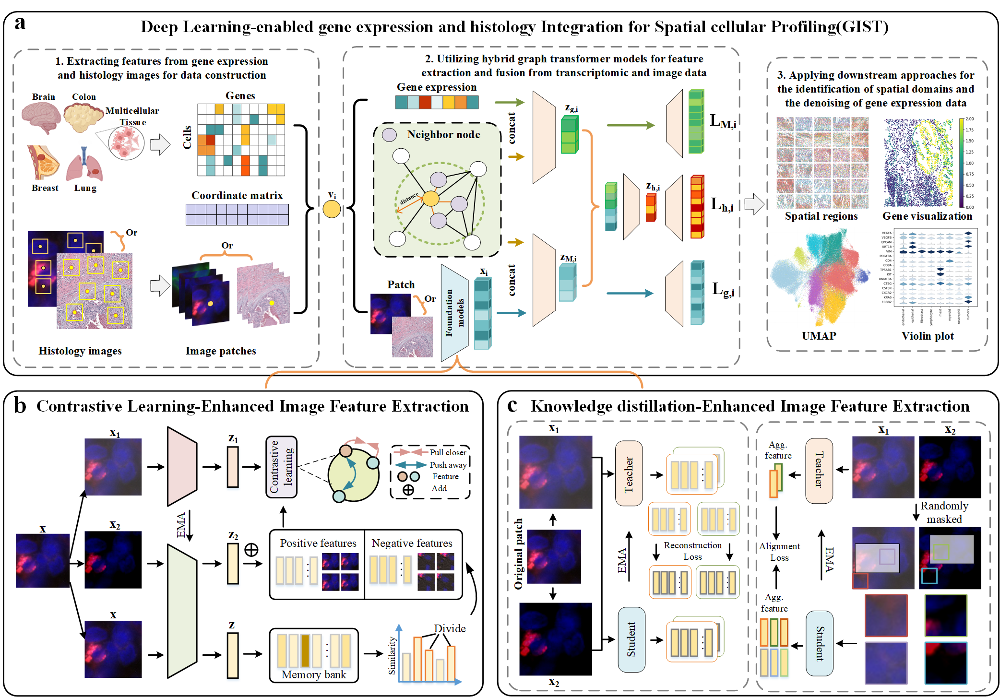

# Deep Learning-Enabled Integration of Histology and Transcriptomics for Analyzing Single-Cell Spatial Profiles
<div id="top"></div>


<!-- PROJECT LOGO -->
<br />
<div align="center">
  <h3 align="center">GIST: deep learning-enabled Gene expression and histology Integration for SpaTial cellular profiling</h3>

  <p align="center">
     Spatially resolved transcriptomics have enabled comprehensive measurement of gene expression patterns at subcellular resolution while preserving spatial context information about the tissue microenvironment. While deep learning has shown promise in analyzing SCST datasets, the rich tissue imaging data detailing subcellular expression and spatial localization remains underexplored. We introduce GIST, a deep learning-enabled Gene expression and histology Integration for SpaTial cellular profiling. GIST leverages histopathology foundation models pre-trained on millions of histology images to enhance feature extraction and employs a hybrid graph transformer model to integrate image and transcriptome features. Validated on human lung, breast, and colorectal cancers datasets, GIST effectively reveals spatial domains and significantly improves the accuracy of segmenting the microenvironment and de-noising transcriptomics data. This enhancement enables more accurate gene expression analysis and aids in identifying prognostic marker genes from differentially expressed genes (DEGs), outperforming state-of-the-art deep learning methods by up to 49.72\%. GIST provides a generalizable framework for integrating histology with spatial transcriptome analysis, revealing novel insights into spatial organization and functional dynamics.
    <br />
 
  </p>
</div>


## Structure of the GIST

(https://github.com/lengjk1214/GIST)

GIST contains 1. Extracting features from gene expression and image patches for data construction. For the cell populations of the four different anatomic sites, next-generation sequencing was used to detect the types, amounts and spatial location of various types of gene produced by specific cell types. The overall inputs to GIST include gene expression profiles and cell location formation obtained by sequencing as well as multiplex immunofluorescence images. 2. Utilizing hybrid graph transformer model for feature extraction and fusion from transcriptomic and image data. The image patch is fed into the feature extractor to get embedding feature $x_i$. For any cell $v_i$, it includes gene expression information, gene neighbourhood graph and image information. These information are merged and fed into three different graph transformer autoencoders to get the final gene embedding loss, image embedding loss and hybrid embedding loss respectively. 3. Applying downstream approaches for the identification of spatial domains and the denoising of gene expression data.

* In the data preprocessing stage, we obtained gene expression profiles and cell spatial location information from spatial transcriptomic data, and selected multiplex immunofluorescence images containing cell morphology as multimodal input to GIST.
* In feature extractor and hybrid graph transformer model stage, we employed the pre-trained self-supervised learning-enhanced image feature extraction as the feature extractor for multiplex immunofluorescence images. First, the initial image was divided into patches according to the spatial position of the cells. These segmented image patches were used as the input of the image feature extraction, and then pre-trained model employed self-supervised learning to extract image features, leveraging this approach to enhance the discriminative power of the learned representations. The extracted image features obtained and the transcriptome features obtained by gene expression profiles were then input into hybrid graph transformer model to obtain the final enhanced gene expression profile.
* In downstream analysis stage, we analyzed the transcriptomic alterations within the enhanced datasets generated by GIST, facilitating various forms of downstream analysis.

<p align="right">(<a href="#top">back to top</a>)</p>


## Requirements

Required modules can be installed via requirements.txt under the project root
```
pip install -r requirements.txt
```

```
anndata==0.8.0
conda==23.1.0
h5py==3.8.0
louvain==0.8.2
matplotlib==3.5.3
opencv-python==4.8.1.78
pandas==1.3.4
Pillow==9.5.0
rpy2==2.9.4
scanpy==1.9.1
scipy==1.7.3
seaborn==0.12.2
stlearn==0.4.12
tensorboard==2.11.2
tensorflow==2.11.0
tifffile==2021.11.2
torch==1.13.1
torch-geometric==2.3.1
torchaudio==0.13.1
torchvision==0.14.1
umap-learn==0.5.4
```

<p align="right">(<a href="#top">back to top</a>)</p>


<!-- GETTING STARTED -->
## Dataset Setting


### Data available

1. NanoString CosMx SMI [here](https://nanostring.com/products/cosmx-spatial-molecular-imager/ffpe-dataset/nsclc-ffpe-dataset/)
2. Human breast cancer [here](https://www.10xgenomics.com/datasets/human-breast-cancer-block-a-section-1-1-standard-1-0-0)
3. Human breast cancer2 [here](https://www.10xgenomics.com/datasets/human-breast-cancer-block-a-section-1-1-standard-1-0-0)
4. Human Colorectal Cancer [here](https://www.10xgenomics.com/datasets/human-colorectal-cancer-11-mm-capture-area-ffpe-2-standard)

### Folder Structure
```
├── requirement.txt
├── dataset
│   └── nanostring
│        └── Lung13_exprMat_file.csv
│        └── matched_annotation_all.csv
│        └── fov1
│              ├── CellComposite_F001.jpg
│              ├── sampledata.h5ad
│        └── fov2
│              ├── CellComposite_F002.jpg
│              ├── sampledata.h5ad
│   └── human cancer
│        └── full_image.tif
│        └── sampledata.h5ad
│   └── colorectal
│        └── full_image.tif
│        └── sampledata.h5ad
|
├── checkpoint
│   └── nanostring_final
│        ├── final.pth
│   └── human cancer
│        ├── final.pth
│   └── colorectal
│        ├── final.pth
```


## Train
1. for NanoString CosMx SMI 
```
python3 train.py --dataset nanostring --test_only 0 --save_path ../checkpoint/nanostring/ --seed 1234 --epochs 1000 --lr 1e-3 
```
2. for Human Breast Cancer
```
python3 train.py --dataset breast --test_only 0 --save_path ../checkpoint/reast/ --seed 1234 --epochs 1000 --lr 1e-3 
```
3. for Human Breast Cancer2 
```
python3 train.py --dataset breast2 --test_only 0 --save_path ../checkpoint/breast2/ --seed 1234 --epochs 1000 --lr 1e-3 
```
4. for Human Colorectal Cancer
```
python3 train.py --dataset colorectal --test_only 0 --save_path ../checkpoint/colorectal/ --seed 1234 --epochs 1000 --lr 1e-3 
```
<p align="right">(<a href="#top">back to top</a>)</p>

## Tutorials (nanostring for example)
1. Create Patch-level model(CTransPath and UNI)
```
from ctran import ctranspath

model = ctranspath()
model.head = nn.Identity()
td = torch.load(r'../model/ctranspath.pth')
model.load_state_dict(td['model'], strict=True)
model.eval()
```

```
import timm
local_dir = "../model"
model = timm.create_model(
        "vit_large_patch16_224", img_size=224, patch_size=16, init_values=1e-5, num_classes=0, dynamic_img_size=True
  )
model.load_state_dict(torch.load(os.path.join(local_dir, "UNI.bin"), map_location="cpu"), strict=True)
model.eval()
```

2.  Get patch features
```

def gen_adatas(root, id, img_name, model):
    adata = sc.read(os.path.join(root, id, 'sampledata.h5ad'))
    adata.var_names_make_unique()
    sc.pp.normalize_total(adata, target_sum=1e4)
    sc.pp.log1p(adata)

    ncluster = len(set(adata.obs['merge_cell_type']))

    print(os.path.join(root, id, 'CellComposite_%s.jpg'%(img_name)))
    img = cv2.imread(os.path.join(root, id, 'CellComposite_%s.jpg'%(img_name)))
    height, width, c = img.shape
    img = cv2.cvtColor(img, cv2.COLOR_BGR2RGB)

    transform = transforms.ToTensor()
    img = transform(img)

    df = pd.DataFrame(index=adata.obs.index)
    df['cx'] = adata.obs['cx']
    df['cy'] = adata.obs['cy']
    arr = df.to_numpy()
    adata.obsm['spatial'] = arr

    patchs = []
    w, h = 120, 120
   
    for (x, y) in zip(adata.obs['cx'], adata.obs['cy']):
        
        if x < w or y < h:
            img_p = img[:, int(y-60):int(y+60), int(x-60): int(x+60)]
        else:
            img_p = img[:, int(y-h):int(y+h), int(x-w): int(x+w)]
        resize = transforms.Resize((224, 224))
        image_resized = resize(img_p)
        image_resized = image_resized.unsqueeze(0)
        with torch.no_grad():
            feature = model(image_resized)
            feature = feature.cpu().numpy()
        feature = torch.tensor(feature.squeeze())
        patchs.append(feature.squeeze())
      
    patchs = np.stack(patchs)
    df = pd.DataFrame(patchs, index=adata.obs.index)
    adata.obsm['imgs'] = df

    Cal_Spatial_Net(adata, rad_cutoff=80)
    Stats_Spatial_Net(adata)
    return adata

ids = [
        'fov1', 'fov2', 'fov3', 'fov4', 'fov5',
        'fov6', 'fov7', 'fov8', 'fov9', 'fov10',
        'fov11', 'fov12', 'fov13', 'fov14', 'fov15',
        'fov16', 'fov17', 'fov18', 'fov19', 'fov20'
    ]
    img_names = [
        'F001', 'F002', 'F003', 'F004', 'F005',
        'F006', 'F007', 'F008', 'F009', 'F010',
        'F011', 'F012', 'F013', 'F014', 'F015',
        'F016', 'F017', 'F018', 'F019', 'F020'
    ]

adatas = list()
for id, name in zip(ids, img_names):
   adata = gen_adatas(opt.root, id, name, model, opt.save_path)
   adatas.append(adata)

sp = os.path.join(opt.save_path)
if not os.path.exists(sp):
    os.makedirs(sp)

file_path = os.path.join(sp, "adatas_list.pkl")
with open(file_path, 'wb') as file:
    pickle.dump(adatas, file)
```

3.  Running Inference
Load patch-level features

```
sp = os.path.join(opt.save_path)
file_path = os.path.join(sp, "adatas_list.pkl")
with open(file_path, 'rb') as file:
  adatas = pickle.load(file)

```

Test nanostring: get image prediction result
```
pth_list = ['final_200_0.pth','final_300_0.pth','final_400_0.pth',
      'final_500_0.pth','final_600_0.pth','final_700_0.pth',
      'final_800_0.pth','final_900_0.pth','final_1000_0.pth'
      ]
for i in pth_list:
    opt.pretrain = i
    adata, _ = test_nano_fov(opt, adatas, hidden_dims=[512, 30],  n_epochs=opt.epochs, save_loss=True, 
                lr=opt.lr, random_seed=opt.seed, save_path=sp, ncluster=opt.ncluster, repeat=r)
    print(adata.obsm['pred'].shape)

    sc.pp.neighbors(adata, use_rep='pred')
    sc.tl.umap(adata)
    plt.rcParams["figure.figsize"] = (3, 3)


    sp2 = os.path.join(opt.result_path)
    if not os.path.exists(sp2):
        os.makedirs(sp2)

    sc.settings.figdir = sp2
    ax = sc.pl.umap(adata, color=['merge_cell_type'], show=False, title='combined latent variables')
    plt.savefig(os.path.join(sp2, 'umap_%s.pdf'%opt.pretrain[:-4]), bbox_inches='tight')

    adata.obsm['imgs'] = adata.obsm['imgs'].to_numpy()
```

4.  Clustering the fovs
```
def res_search(adata_pred, ncluster, seed, iter=200):
  start = 0; end = 3
  i = 0
  while(start < end):
      if i >= iter: return res
      i += 1
      res = (start + end) / 2
      print(res)
      seed_everything(seed)
      random.seed(seed)
      os.environ['PYTHONHASHSEED'] = str(seed)
      np.random.seed(seed)
      torch.manual_seed(seed)
      torch.cuda.manual_seed(seed)
      os.environ['CUBLAS_WORKSPACE_CONFIG'] = ':4096:8'
      torch.backends.cudnn.deterministic = True
      torch.backends.cudnn.benchmark = False
      sc.tl.leiden(adata_pred, random_state=seed, resolution=res)
      count = len(set(adata_pred.obs['leiden']))
      # print(count)
      if count == ncluster:
          print('find', res)
          return res
      if count > ncluster:
          end = res
      else:
          start = res
  raise NotImplementedError()

res = res_search(adata, 8, seed)
```

5.  Evaluation

(1) Cell type matching
```
adata = adata[adata.obs['merge_cell_type'].notna()]

cell_type = list(set(adata.obs['merge_cell_type']))
ground_truth = [i for i in range(len(cell_type))]  
gt = np.zeros(adata.obs['merge_cell_type'].shape)
for i in range(len(ground_truth)):
    ct = cell_type[i]
    idx = (adata.obs['merge_cell_type'] == ct)
    gt[idx] = i
gt = gt.astype(np.int32)

pred = adata.obs['leiden'].to_numpy().astype(np.int32)
layers = []
cs = ['' for i in range(pred.shape[0])]
gt_cs = ['' for i in range(pred.shape[0])]
match = _hungarian_match(pred, gt, len(set(pred)), len(set(gt)))
colors = {
        'endothelial':"#26C5D9FF",
        'epithelial':'#D3E057FF',
        'fibroblast':'#26A599FF',
        'lymphocyte':'#E57272FF',
        'mast':'#5B6BBFFF', 
        'myeloid':'#FFCA27FF',
        'neutrophil':'#B967C7FF',
        'tumors':'#A6CEE3',
    }
cs = ['' for i in range(pred.shape[0])]
gt_cs = ['' for i in range(pred.shape[0])]

for ind, j in enumerate(adata.obs['merge_cell_type'].tolist()):
    gt_cs[ind] = colors[j]

for outc, gtc in match:
    idx = (pred == outc)
    for j in range(len(idx)):
        if idx[j]:
            cs[j] = colors[cell_type[gtc]]
adata.obs['cmap'] = cs
adata.obs['gtcmap'] = gt_cs
```

(2) Spatial domains 
```
python3 spatial.py
```

```
begin = 0
end = 0
fig,axes=plt.subplots(6,5, figsize=(12, 10))
                   
plt.subplots_adjust(left=0.05,top=0.95,wspace=0,hspace=0)
color = adata.obs['gtcmap']
for idx, value in enumerate(new_order):
    ax = axes.flat[value]
    cur_idx = fov_list[idx]
    end = end + cur_idx
    subset_cxg = cxg[begin:end] 
    subset_cyg = cyg[begin:end]
    colors = color[begin:end]
    ax.invert_yaxis()
    ax.scatter(subset_cxg, subset_cyg, c=colors, s=1)  
    ax.axis('off')
    
    begin = begin + cur_idx
# plt.legend(bbox_to_anchor=(1.04,1), loc="center left",handles=legend_patches)
plt.savefig(path2, bbox_inches='tight')

begin = 0
end = 0
fig,axes=plt.subplots(6,5, figsize=(12, 10))
plt.subplots_adjust(left=0.05,top=0.95,wspace=0,hspace=0)
color = adata.obs['cmap']
for idx, value in enumerate(new_order):
    ax = axes.flat[value]
    cur_idx = fov_list[idx]
    end = end + cur_idx
    subset_cxg = cxg[begin:end] 
    subset_cyg = cyg[begin:end]
    colors = color[begin:end]
    ax.invert_yaxis()
    ax.scatter(subset_cxg, subset_cyg, c=colors, s=1)  
    ax.axis('off')
    
    begin = begin + cur_idx

# plt.legend(bbox_to_anchor=(1.04,1), loc="center left",handles=legend_patches) 
plt.savefig(path3, bbox_inches='tight')
```

(3) Create UMAP
```
python3 umap_all.py
```

```
sc.pp.neighbors(adata, use_rep='pred')
sc.tl.umap(adata)
plt.rcParams["figure.figsize"] = (3, 3)
ax = sc.pl.umap(adata, color=['merge_cell_type'],palette = colors,  show=False, title='combined latent variables')
plt.savefig(path2, bbox_inches='tight')

sc.pp.neighbors(adata,use_rep='X')
sc.tl.umap(adata)
plt.rcParams["figure.figsize"] = (3, 3)
ax = sc.pl.umap(adata, color=['merge_cell_type'],palette = colors,  show=False, title='combined latent variables')
plt.savefig(path3, bbox_inches='tight')
```

(4) Create Violin 
```
python3 violin.py
```

```
marker_genes = [
    "VEGFA",'VEGFB', # Endothelial
    'EPCAM','KRT18', # Epithelial
    'VIM','PDGFRA', # Fibroblast
    'CD4','CD8A', # Lymphocyte
    'TPSAB1','KIT', # Mast
    'DNMT3A','CTSG', # Myeloid
    'CSF3R','CXCR2',# neutrophil
    'KRAS','ERBB2', # tumors
]

sc.pl.stacked_violin(adata, marker_genes, groupby='merge_cell_type', swap_axes=True, 
                    categories_order=['endothelial', 'epithelial', 'fibroblast', 'lymphocyte', 'mast', 'myeloid',
                         'neutrophil', 'tumors'],
                    figsize=[6,4],vmax = 1.5)
plt.savefig(path2, bbox_inches='tight')

recon_data = adata.copy()
recon_data.X = recon_data.layers['recon']
sc.pl.stacked_violin(recon_data, marker_genes, groupby='leiden_color', swap_axes=True, 
                    categories_order=['endothelial', 'epithelial', 'fibroblast', 'lymphocyte', 'mast', 'myeloid',
                         'neutrophil', 'tumors'],
                     figsize=[6,4],vmax = 1.5)
plt.savefig(path3, bbox_inches='tight')
```

## Cite

Please cite our paper if you use this code in your own work.

<p align="right">(<a href="#top">back to top</a>)</p>
